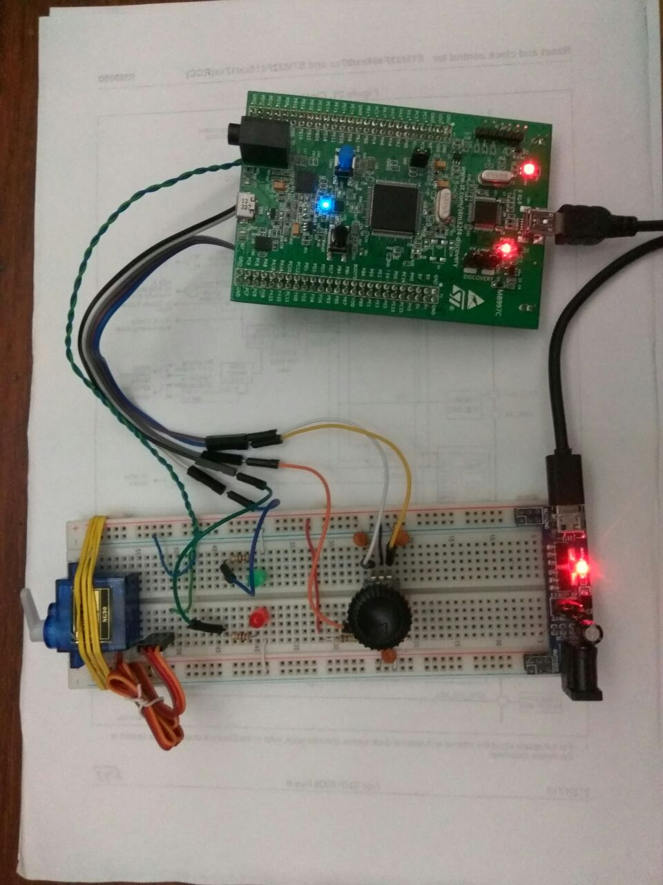

# enc_servo
Educational project in which implemented servo motor controlling using encoder based on STM32F4DISCOVERY. The program is written in Keil IDE using C language and CMSIS lib. It demonstrates basic initializing and configuring microcontrollers peripherals such a system clock, timers and interrupts.

